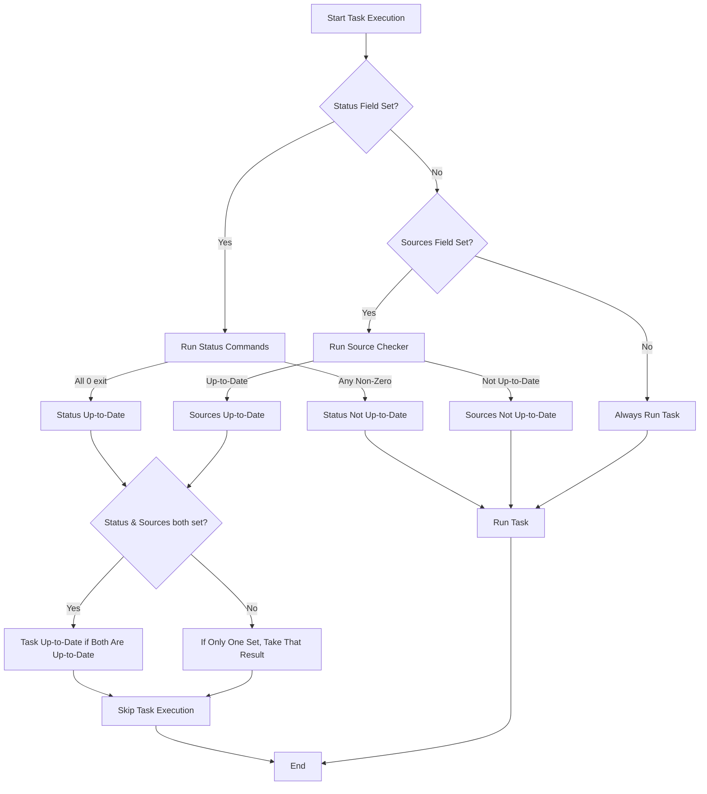

# Optimizing Task Performance

This guide empowers you to speed up your automation by harnessing Task's built-in features to run tasks faster and more efficiently. You'll learn how to use concurrency settings, leverage fingerprinting with up-to-date checks, optimize caching strategies, and minimize unnecessary task executions. These best practices reduce build times and make your workflows more responsive and scalable.

---

## Understanding Up-to-Date Checks

At the heart of optimizing task performance is the concept of **up-to-date checks** — determining whether a task needs to run or can be safely skipped because its outputs are up-to-date.

Task uses **fingerprinting methods** to perform these checks automatically:

- **Source file checksums (`checksum` method)**: Computes a hash of the content and names of source files. If any source changes, the hash changes, triggering the task.
- **Timestamps (`timestamp` method)**: Compares modification times of sources against generated files and a timestamp marker file.
- **Status commands (`status` field)**: Runs custom commands that return success only if the task is up-to-date.

By enabling one or more of these methods on your tasks, Task intelligently avoids redundant runs.

> Tip: Using `checksum` offers a content-level guarantee but can be slower on many files. `timestamp` is faster but relies on file mod times, which can sometimes cause misses in edge cases.


## Key Techniques for Faster Task Runs

### 1. Use Concurrency Controls

Task allows running multiple independent tasks in parallel. To maximize concurrency:

- Define correct dependencies to express task relationships.
- Use the CLI `--parallel` flag or configure concurrency in your Taskfile.
- Avoid unnecessary serial dependencies that block parallelism.

This spreads workload across CPU cores, reducing overall build time.

### 2. Define Accurate `sources` and `generates`

Specify which files your tasks consume (`sources`) and which files they produce (`generates`). This helps Task determine if outputs exist and if sources have changed:

- Clearly list all relevant input files under `sources`.
- List all output files under `generates`, so Task can verify their existence and freshness.
- Avoid overly broad globs that cause unnecessary triggers.

### 3. Select the Appropriate Fingerprinting Method

Control how Task detects changes with the `method` field:

- Use `checksum` for robust content change detection in source files.
- Use `timestamp` for faster checks if modification time accuracy is sufficient.
- Combine with `status` commands for custom up-to-date logic.

Example task with checksum method:

```yaml
version: '3'
tasks:
  build:
    method: checksum
    sources:
      - src/**/*.go
    generates:
      - bin/app
    cmds:
      - go build -o bin/app ./src
```

### 4. Leverage Caching of Fingerprint Data

Task stores state information about source checksums and timestamps in temporary directories:

- These caches speed repeated runs, as Task avoids re-scanning everything anew.
- You can customize cache locations if needed using the `--temp-dir` flag for advanced setups.

### 5. Minimize Unnecessary Executions

Avoid triggers that cause tasks to run when not needed:

- Keep `sources` focused on exact dependencies.
- Ensure generated files exist and are listed correctly.
- Use the `status` feature for complex cases where command exit status determines freshness.


## Real User Workflow: Incremental Build Example

Imagine you have a compilation task that only needs to rebuild when source files change:

1. You specify all `.go` files as your sources.
2. You use the checksum method to verify content changes.
3. You list your binary as a generated file.

On successive Task runs, if none of the source files have changed, Task detects your binary is fresh and skips the build command entirely, saving minutes of time.


## Common Pitfalls and How to Avoid Them

### Missing or Wrong `generates` Files

If you don't list generated files or they do not exist, Task always considers the task outdated. Always verify outputs are created correctly and listed.

### Overbroad `sources` Globs

Including irrelevant files triggers unnecessary rebuilds. Narrow glob patterns lead to more precise change detection.

### Combining Multiple Fingerprint Methods

Using both `status` and `sources` is powerful but requires careful crafting of status commands to return zero only when everything is fresh.

### Cache Invalidation

On radical project changes, caches might need clearing to avoid stale state. You can manually delete Task’s temp directory.


## Troubleshooting Up-to-Date Checks

<AccordionGroup title="Troubleshooting Up-to-Date Checks">
<Accordion title="Why does my task run even though sources haven't changed?">
Check if all expected generated files exist and are listed under `generates`. Missing files force task execution.
Also verify the checksum or timestamp cache directories are writable and not being cleared unexpectedly.
</Accordion>
<Accordion title="Status commands causing tasks to run unexpectedly">
Ensure status commands exit with code 0 only when the task is up-to-date. Non-zero exit status forces re-execution.
Add verbose logging with `--verbose` to see status command results.
</Accordion>
<Accordion title="Checksum method is slow with many source files">
Consider switching to `timestamp` when you can rely on modification times to speed up checks.
Also, exclude irrelevant files from `sources` to reduce hashing work.
</Accordion>
</AccordionGroup>


## Advanced Tips

- Use the `.CHECKSUM` and `.TIMESTAMP` dynamic variables within task commands or status scripts to check current fingerprint values.
- Customize concurrency limits for heavy I/O or CPU-bound tasks to prevent bottlenecks.
- Combine fingerprinting with conditional execution and preconditions for efficient workflows.


## Summary

Optimizing task performance in Task centers on defining precise inputs and outputs, leveraging fingerprints for incremental builds, running tasks in parallel, and employing caching. Master these concepts and you turn your automation into a swift, smarter system that runs only what is necessary, exactly when needed.


## Related Documentation

- [Fingerprinting & Up-to-Date Checks](../../taskfile_concepts/advanced_features/fingerprinting_up_to_date)
- [Performance & Parallelism Tips](../../guides/advanced-features-best-practices/performance-parallelism)
- [Execution Flow & Dependency Resolution](../../taskfile_concepts/core_architecture/execution_flow)
- [Using Variables & Templating](../../guides/advanced-features-best-practices/variables-and-templating)


---

## Appendix: Technical Overview of Fingerprinting Methods

Task uses modular components to validate if a task is up-to-date:

- **ChecksumChecker:** Computes combined hash of all source files including their filenames. Used with `method: checksum`.
- **TimestampChecker:** Compares modification timestamps of sources and generated files, maintaining a timestamp marker file. Used with `method: timestamp`.
- **StatusChecker:** Runs custom status commands defined in `status:` to decide freshness.

The `IsTaskUpToDate` function combines these checks based on which fields (`status`, `sources`) are set on the task.

### Sample Fingerprinting Behavior

```yaml
version: '3'
tasks:
  build-checksum:
    method: checksum
    sources:
      - src/**/*.c
    generates:
      - build/output.o
    cmds:
      - gcc -c src/main.c -o build/output.o

  build-ts:
    method: timestamp
    sources:
      - src/**/*.c
    generates:
      - build/output.o
    cmds:
      - gcc -c src/main.c -o build/output.o

  deploy:
    status:
      - test -f build/output.o
      - test $(stat -c %Y build/output.o) -gt $(stat -c %Y src/main.c)
    cmds:
      - scp build/output.o user@server:/deploy/
```

This setup ensures fine-grained control to skip tasks on no changes, accelerating workflows.


---

## Visual: Up-to-Date Check Decision Flow



This flow shows how Task evaluates freshness and decides if a task runs.


---

## Getting Help

If you encounter issues or inefficiencies:

- Run Task with `--verbose` for detailed logs.
- Review the fingerprint caches and file patterns.
- Consult the [TroubleshootingCommon](../../getting-started/configuration-troubleshooting/troubleshooting-common) guide.
- Reach out to the [community forums](https://github.com/go-task/task/discussions) for support.


---

By mastering these optimization techniques, you transform your Task automation into a performance powerhouse, ensuring your development cycles are fast, reliable, and reproducible.