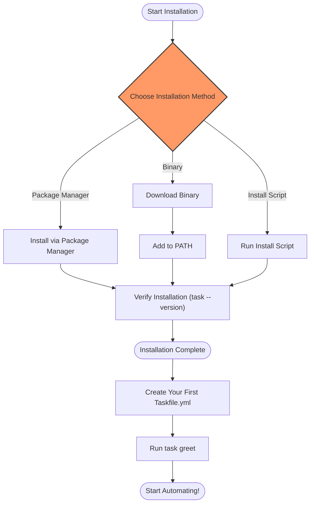

# Installation &amp; First Taskfile

Welcome to your first step in automating workflows with Task! This guide walks you through installing Task on your system and creating your first Taskfile to kickstart your automation journey.

---

## 1. Installation

### Overview
This section helps you quickly install Task on your operating system using easy, reliable methods. Task provides official packages for major platforms and multiple community-supported options.

### Prerequisites
- A supported operating system: Linux, macOS, or Windows.
- Sufficient permissions to install software.
- Basic familiarity with command line interfaces.

### Recommended Installation Methods

#### Official Package Managers (Preferred)
Installing via package managers ensures automatic updates and stable releases.

| Platform  | Method       | Command Example                                     |
| --------- | ------------ | ------------------------------------------------- |
| Fedora / CentOS / RHEL | dnf          | `dnf install task`                                |
| Ubuntu / Debian / Linux Mint | apt         | `apt install task`                                |
| macOS / Linux            | Homebrew     | `brew install go-task/tap/go-task`                |
| Linux / macOS / Windows  | npm          | `npm install -g @go-task/cli`                      |
| Windows                  | WinGet       | `winget install Task.Task`                          |
| Linux                    | Snap         | `sudo snap install task --classic`                 |

See detailed commands and instructions on setting up repositories in the [Installation (All Platforms)](/getting-started/environment-setup/installation) guide.

#### Get The Binary
Download directly from the [GitHub releases page](https://github.com/go-task/task/releases) to place the executable in your `$PATH`.

#### Install Script
An automated install script is available for quick setups, including CI workflows:

```shell
sh -c "$(curl --location https://taskfile.dev/install.sh)" -- -d
```

You can specify installation directory and version if needed:

```shell
sh -c "$(curl --location https://taskfile.dev/install.sh)" -- -d -b ~/.local/bin v3.42.1
```

### Verifying Installation
Run the following to confirm Task is successfully installed:

```shell
task --version
```

You should see the installed Task version printed, confirming readiness.

### Shell Completion Setup (Optional but Recommended)
To improve your command line experience, enable shell completions:

```shell
# Example for bash
eval "$(task --completion bash)"
```

Add this line to your shell configuration (`~/.bashrc`, `~/.zshrc`, or equivalent) for automatic completions on startup.

---

## 2. Creating Your First Taskfile

### What is a Taskfile?
A Taskfile is a YAML file named `Taskfile.yml` located in your project root. It defines tasks — commands or scripts — you want to automate, along with dependencies, variables, and execution context.

### Goal
You'll scaffold a minimal Taskfile that:
- Defines a simple task
- Demonstrates command execution
- Shows how to run your task

### Step-by-Step: Scaffold and Run
<Steps>
<Step title="Create a `Taskfile.yml`">
In your project directory, create a file named `Taskfile.yml`.

Add the following content:

```yaml
version: '3'
tasks:
  greet:
    cmds:
      - echo "Hello, Task!"
```

This defines a task `greet` that simply prints a message.
</Step>

<Step title="Run your first task">
Execute your task with:

```shell
task greet
```

You should see output:

```
Hello, Task!
```

indicating the task ran successfully.
</Step>

</Steps>

### Understanding This Example
- `version: '3'`: Specifies the Taskfile version (always use the current stable version).
- `tasks`: Root key for tasks definitions.
- `greet`: Task name.
- `cmds`: List of commands the task will run.

### Extending Your Taskfile
Start simple, then gradually introduce:
- Variables and templating
- Dependencies between tasks
- Runtime environment control
- Task grouping and includes

Explore these in the guides: [Basic Configuration &amp; Taskfile Structure](/getting-started/configuration-troubleshooting/configuration-basics).

---

## 3. Recommended Project Structure

Place your `Taskfile.yml` at your project's root folder alongside your main codebase. This keeps your build and automation workflow centralized and discoverable.

```plaintext
/my-project
  ├─ Taskfile.yml
  ├─ src/
  ├─ README.md
  └─ ...
```

> Keeping your Taskfile version-controlled ensures reproducible automation for all team members.

---

## 4. Troubleshooting Installation

<AccordionGroup title="Common Installation Issues">
<Accordion title="Task command not found after install">
Verify your binary is added to your system's PATH.

Example:

```shell
echo $PATH
# On macOS/Linux
which task
# On Windows (PowerShell)
Get-Command task
```

Add install directory to PATH if missing.

</Accordion>
<Accordion title="Permission denied during installation">
Try running installation commands with elevated privileges using `sudo` (macOS/Linux).

Ensure you have administrator rights on Windows.
</Accordion>
<Accordion title="Incorrect version or command fails">
Confirm you downloaded the latest version for your OS.

Use `task --version` to validate.

If you used a package manager, consider updating or reinstalling the package.
</Accordion>
<Accordion title="Shell completions not working">
Ensure you added the completion script to the right shell config file.

Restart your terminal or source the config file.

Check compatibility with your shell version.
</Accordion>
</AccordionGroup>

---

## 5. Next Steps

- Dive into writing complex tasks and working with variables in [Writing and Running Tasks](/guides/getting-started-workflows/writing-running-tasks).
- Explore task dependencies to build multi-step workflows.
- Review best practices for organizing Taskfiles in [Basic Configuration &amp; Taskfile Structure](/getting-started/configuration-troubleshooting/configuration-basics).

{/*
Removed invalid component <Taskfile Installation Flow Diagram>
*/}



---

## Tips for Success

<Tip>
Keep your Taskfile simple initially. Focus on automating frequent tasks to build confidence.
</Tip>

<Tip>
Use version control for your Taskfile to share automation across your team and maintain workflow consistency.
</Tip>

<Tip>
Explore Task's built-in help with `task --help` for quick command reference.
</Tip>

---

## Summary
This guide introduced the installation of Task on multiple platforms, verified successful installs, and walked you through creating and running a simple Taskfile to launch your automation journey.

For troubleshooting issues or exploring more advanced capabilities, consult the following pages.

---