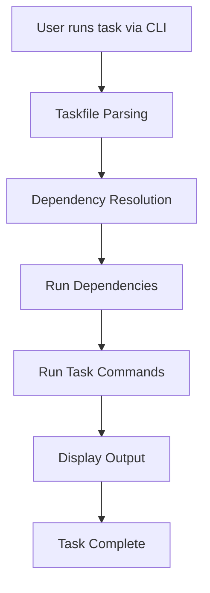

# Writing and Running Tasks

This guide takes you through defining custom tasks in your Taskfile, illustrating how to create commands, set dependencies, use variables, and execute tasks using the CLI. You'll start with simple single-step tasks and progress to more complex, multi-step task definitions with practical examples.

---

## 1. Understanding Tasks

### What is a Task?
A task is a reusable unit of work defined in your Taskfile. Each task can run one or more commands, depend on other tasks, and accept variables. Tasks help automate your development workflows by encapsulating commands in a structured and maintainable way.

### Why Define Tasks?
Defining tasks enables consistent, repeatable execution of commands such as build steps, tests, deployment scripts, or environment setups without manually typing commands repeatedly.

---

## 2. Prerequisites

Before defining tasks:

- Ensure you have Task installed and accessible via the CLI.
- Have a `Taskfile.yml` in your project root or create one.
- Basic familiarity with YAML syntax.
- Optional: understanding of variables and CLI usage for advanced task parameters.

---

## 3. Task Definition Basics

### Minimal Task Example
Define a simple task that runs a single command:

```yaml
version: '3'
tasks:
  greet:
    cmds:
      - echo 'Hello, Task!'
```

Run this task from your terminal:

```bash
task greet
```

Expected output:

```
Hello, Task!
```

### What You Did:
- Created a task named `greet`.
- Assigned a single shell command to run with `cmds`.

---

## 4. Adding Multiple Commands to a Task

Tasks can execute multiple commands sequentially.

```yaml
version: '3'
tasks:
  build:
    cmds:
      - echo 'Starting build...'
      - echo 'Compiling sources'
      - echo 'Build complete.'
```

Run:

```bash
task build
```

This runs each command in order, showing output step-by-step.

---

## 5. Task Dependencies

Dependencies let you chain tasks so that prerequisites run automatically before the main task.

### Example: Task with Dependencies

```yaml
version: '3'
tasks:
  task-with-summary:
    summary: |
      summary of task-with-summary - line 1
      line 2
      line 3
    deps: [dependent-task-1, dependent-task-2]
    cmds:
      - echo 'task-with-summary was executed'
      - echo 'another command'
      - exit 0

  dependent-task-1:
    cmds:
      - echo 'dependent-task-1 was executed'

  dependent-task-2:
    cmds:
      - echo 'dependent-task-2 was executed'
```

### Execution Flow:
When you run:

```bash
task task-with-summary
```

You will see output from `dependent-task-1` and `dependent-task-2` before the main task executes:

```
dependent-task-1 was executed
dependent-task-2 was executed
task-with-summary was executed
another command
```

This chaining ensures prerequisites complete before the main task runs.

---

## 6. Summaries: Documenting Your Tasks

Add a `summary` field to provide descriptions for what a task does. This summary can span multiple lines and appears in task listings.

```yaml
summary: |
  summary of task-with-summary - line 1
  line 2
  line 3
```

Use summaries to help others (and yourself) understand task purposes at a glance.

---

## 7. Using Variables in Tasks

Tasks support variables for flexible execution. Variables allow you to parameterize commands.

### Declaring Variables
Variables are often declared outside tasks or passed during CLI invocation.

### Example of using variables in a command:

```yaml
version: '3'
tasks:
  greet:
    vars:
      name:
        default: 'World'
    cmds:
      - echo 'Hello, {{.name}}!'
```

Run with:

```bash
task greet
```
Outputs:

```
Hello, World!
```

Or override a variable:

```bash
task greet --name=Alice
```

Outputs:

```
Hello, Alice!
```

### Tip:
Always validate variable names and defaults to avoid unexpected blank outputs.

---

## 8. Running Tasks via CLI

### Basic Command

Run any task defined in your Taskfile:

```bash
task <task-name>
```

Example:

```bash
task build
```

### Listing All Tasks

To see all available tasks with summaries:

```bash
task --list
```

This helps when working with unfamiliar Taskfiles.

### Passing Variables

Pass variables on the CLI to customize runs:

```bash
task greet --name=Bob
```

### Running Dependent Tasks Automatically

Dependencies will execute automatically when you run a task with dependencies.

---

## 9. Advanced: Multi-Step and Nested Tasks

You can run a task from within another task's commands:

```yaml
version: '3'
tasks:
  task1:
    cmds:
      - echo 'Running task1 commands'

  task2:
    cmds:
      - task: task1
      - echo 'Then running task2 commands'
```

This runs `task1` commands first, then continues.

Run:

```bash
task task2
```

Output:

```
Running task1 commands
Then running task2 commands
```

---

## 10. Practical Example: A Realistic Taskfile

```yaml
version: '3'
tasks:
  setup:
    summary: Prepare development environment
    cmds:
      - echo 'Installing dependencies'
      - echo 'Setting up environment variables'
  test:
    deps: [setup]
    summary: Run all tests
    cmds:
      - echo 'Running unit tests'
      - echo 'Running integration tests'
  deploy:
    deps: [test]
    cmds:
      - echo 'Deploying application'
```

### Workflow
- Run `task deploy`
- `setup` runs first
- Then `test` runs
- Finally `deploy` commands execute

---

## 11. Troubleshooting & Tips

<AccordionGroup title="Common Issues & Tips">
<Accordion title="Task Not Found">
Ensure your `Taskfile.yml` is in the current directory or specify it with `--taskfile`.
</Accordion>
<Accordion title="Commands Fail to Run">
Check command syntax, environment PATH, and permissions.
Use `task -v` (verbose) to see detailed error output.
</Accordion>
<Accordion title="Variables Not Replacing">
Verify variable names match exactly and provide defaults or pass via CLI.
</Accordion>
<Accordion title="Dependencies Not Running">
Confirm dependencies are listed correctly using `deps` with accurate task names.
</Accordion>
<Accordion title="Multi-Command Tasks Not Completing">
Commands run sequentially; ensure none exit prematurely unless intended.
</Accordion>
</AccordionGroup>

<Check>
For a clear task organization, group related commands in separate tasks connected by dependencies.
</Check>

---

## 12. Next Steps & Related Guides

- Explore [Using Variables & Templating](/guides/advanced-features-best-practices/variables-and-templating) to learn advanced parameterization.
- Learn about [Including and Sharing Taskfiles](/guides/advanced-features-best-practices/including-sharing-taskfiles) to modularize your workflows.
- Deepen understanding with [Execution Flow & Dependency Resolution](/taskfile_concepts/core_architecture/execution_flow).
- For troubleshooting, see [Troubleshooting & Validation](/getting-started/configuration-troubleshooting/troubleshooting-common).

---

### Summary Diagram: Task Execution Flow



This flow shows how your task request translates into running dependencies first and then the actual commands.


---

You are now equipped to define and run powerful, maintainable tasks tailored to your automation needs. Experiment with dependencies, command sequences, and summaries to create robust workflows.


---

*For complete Taskfile specification and advanced usage, visit the official docs at https://taskfile.dev*