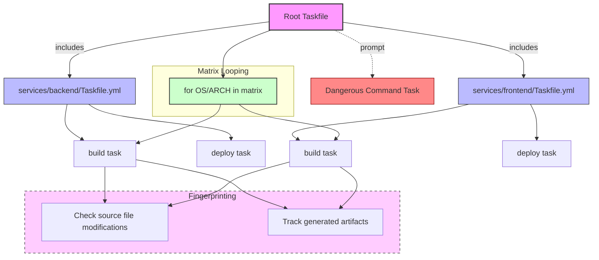

# Project Templates & Real Project Examples

Explore a curated collection of sample Taskfiles drawn from real projects and open-source initiatives. This page serves as your inspiration hub and practical blueprint for creating efficient, maintainable automation in your own Taskfiles. Whether you are a new user looking for a starting point or an advanced user seeking proven complex workflows, these examples provide actionable patterns and directory structures that demonstrate best practices in real-world applications.

---

## Purpose and Value

Taskfiles are central to defining automation workflows tailored to project needs. Real project examples reveal how Task's features—like includes, variables, conditional execution, and fingerprinting—are employed to build scalable, cross-platform automation. By examining actual Taskfiles mapped to project directory layouts, you gain insight into organization strategies, reusable components, and integration patterns that ensure maintainability and developer productivity.

---

## Navigating the Examples

The samples cover a variety of common and advanced scenarios:

- **Monorepo setups with namespace includes:** Shows how to modularize large projects with included Taskfiles in each service or component, passing variables and using namespaces for task calls.
- **Matrix loops in commands and dependencies:** Illustrates looping over OS and architecture combinations for build and test automation.
- **Source and generate file fingerprinting:** Demonstrates automated skipping of unnecessary work by tracking input/output artifacts.
- **Conditional execution with preconditions and prompts:** Highlights task safety and guarding potentially dangerous commands.
- **Environment and `.env` management:** Examples of environment overrides and `.env` file usage at both global and task levels.

These patterns are aligned with the broader Task docs, particularly the guides on [including and sharing Taskfiles](https://taskfile.dev/guides/advanced-features-best-practices/including-sharing-taskfiles), [variables and templating](https://taskfile.dev/guides/advanced-features-best-practices/variables-and-templating), and [common workflows](https://taskfile.dev/guides/getting-started-workflows/common-workflows).

---

## Model Example: Monorepo Service Directory with Includes

A typical pattern involves a root Taskfile that includes Taskfiles from service subdirectories, passing service-specific variables and managing namespace aliases:

```yaml
version: '3'

includes:
  backend:
    taskfile: ./services/backend/Taskfile.yml
    dir: ./services/backend
    vars:
      SERVICE_NAME: backend
    aliases: [be]

  frontend:
    taskfile: ./services/frontend/Taskfile.yml
    dir: ./services/frontend
    vars:
      SERVICE_NAME: frontend
    aliases: [fe]

tasks:
  deploy:
    desc: Deploy all services
    deps: [backend:deploy, frontend:deploy]
```

This allows users to run `task be:build` or `task fe:deploy`. Each service Taskfile can independently define variables, commands, and dependencies relevant to its context.

---

## Looping Over Platforms for Builds

Matrix loops are frequently used for cross-platform builds and tests.

Example snippet:

```yaml
vars:
  OS_LIST: [windows, linux, darwin]
  ARCH_LIST: [amd64, arm64]

tasks:
  build-all:
    cmds:
      - for:
          matrix:
            OS:
              ref: .OS_LIST
            ARCH:
              ref: .ARCH_LIST
        cmd: |
          echo "Building for {{.ITEM.OS}}/{{.ITEM.ARCH}}"
          # Insert canonical build command here
```

This shows how to dynamically generate builds for all OS-Arch combinations.

---

## Fingerprinting to Avoid Unnecessary Builds

Using the `sources` and `generates` keys, Task can smartly skip tasks when input files haven't changed:

```yaml
tasks:
  build-js:
    sources:
      - src/js/**/*.js
    generates:
      - public/bundle.js
    cmds:
      - esbuild --bundle --minify src/js/index.js > public/bundle.js
```

When run, Task verifies checksums or timestamps of sources relative to generates, only executing the task if inputs have changed.

---

## Using Taskfile Includes with Variables

Includes enable modular Taskfiles, where variables can be passed to customize behavior:

```yaml
includes:
  docker:
    taskfile: ./docker/DockerTasks.yml
    vars:
      IMAGE_NAME: my-app-backend

  frontend:
    taskfile: ./frontend/Taskfile.yml
    vars:
      BUILD_MODE: production
```

This pattern supports DRY principles and reuse across projects.

---

## Practical Tips

- **Namespace your includes:** Avoid task name collisions by carefully naming includes.
- **Use flatten sparingly:** Flattening included Taskfiles removes namespaces but risks conflicts.
- **Define preconditions:** Guard build or deploy tasks with meaningful checks.
- **Employ prompts for risky actions:** Protect destructive commands by prompting users.
- **Leverage `.env` files:** Manage environment configuration flexibly.
- **Take advantage of variables & references:** Pass complex data efficiently.
- **Customize output modes:** Use `prefixed` or `group` output styles to improve CI log readability.

---

## Troubleshooting

### Included Taskfile Not Found
- Confirm include paths are correct relative to the main Taskfile.
- Use `optional: true` to avoid errors if the file is missing but you want graceful fallback.

### Task Not Found When Calling Included Task
- Verify namespace and task names.
- Ensure `flatten` mode does not cause task name collisions.

### Fingerprinting Always Runs
- Ensure `sources` patterns correctly match actual files.
- Verify that the `.task` directory is not deleted or ignored improperly.

### Prompts Not Appearing in CI
- Use `--yes` flag to auto-approve prompts in non-interactive environments.

### Unexpected Variable Behavior
- Review variable scoping and precedence.
- Use explicit references (`ref:`) to maintain non-string types across tasks.

---

## Summary

This page equips you with real-world Taskfile patterns and directory structures modeled on actual projects. Use these samples to accelerate your automation, avoid pitfalls, and follow best practices proven at scale.

---

## Related Documentation

- [Guide - Including and Sharing Taskfiles](https://taskfile.dev/guides/advanced-features-best-practices/including-sharing-taskfiles)
- [Guide - Using Variables & Templating](https://taskfile.dev/guides/advanced-features-best-practices/variables-and-templating)
- [Guide - Common Automation Workflows](https://taskfile.dev/guides/getting-started-workflows/common-workflows)
- [Guide - Conditional Execution & Preconditions](https://taskfile.dev/guides/advanced-features-best-practices/conditional-execution-preconditions)
- [Guide - Task and Shell Scripting](https://taskfile.dev/guides/integration-real-world-examples/shell-scripting-interop)

---

## Next Steps

- Explore the provided sample Taskfiles in the project repositories, adapting examples for your use case.
- Experiment with includes and modular Taskfiles to organize large projects.
- Leverage variables, loops, and conditionals to build dynamic and responsive automation.
- Study related guides on performance, parallelism, and environment management to advance your Taskfile mastery.

---

## Visual Workflow: From Root Taskfile to Modular Project Automation



This diagram summarizes the typical structure of a real project leveraging Taskfiles with includes, matrix loops, fingerprinting checks, and safety prompts.

---