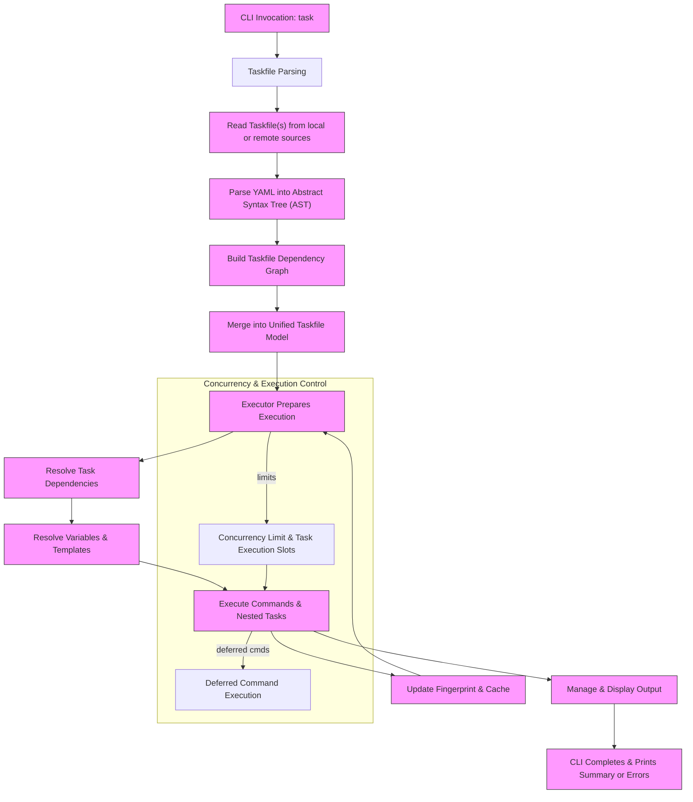

# System Architecture

## Understanding How Task Works: A High-Level Overview

Task is designed to be a simple yet powerful automation tool. To truly leverage its capabilities, it's essential to grasp the high-level architecture: how Task interprets Taskfiles, resolves dependencies, manages variables, executes commands, and provides output. This page visually and conceptually lays out the flow from your CLI invocation to the final command execution, highlighting key components and extensibility points.

---

## Why This Matters to You

Imagine running a complex automation workflow involving multiple tasks with dependencies and custom variables. Task orchestrates all of this seamlessly behind the scenes. This architecture overview empowers you to understand what's happening internally as you interact with Task, helping you troubleshoot issues, debug your Taskfile configurations, and understand how features like caching, dependency management, and variable resolution contribute to efficient and reliable automation.

---

## The Execution Flow: From CLI to Command

At a glance, the lifecycle of a Task execution begins when you run the Task CLI, pointing it at your Taskfile. Task then proceeds through several key stages:

1. **CLI Invocation:** You enter a command like `task build`.
2. **Taskfile Parsing:** The Taskfile (plus any included files) is read and parsed into an Abstract Syntax Tree (AST).
3. **Dependency Resolution:** Task resolves all dependencies, ensuring prerequisites run before dependent tasks.
4. **Variable Resolution:** Variables and templates are processed, substituting dynamic values for commands.
5. **Task Execution:** Each command within tasks is executed in order, respecting platform constraints.
6. **Output Handling:** Command output is managed and displayed according to your configuration.

This flow repeats recursively for dependencies and nested commands.

---

## Key Architectural Components

| Component                  | Purpose                                                                                       |
|----------------------------|-----------------------------------------------------------------------------------------------|
| **CLI**                    | Entry point; translates user commands into Taskfile requests and controls execution modes.    |
| **Taskfile Reader & Parser** | Reads a Taskfile from local or remote sources, parses YAML, and creates an AST.              |
| **Taskfile Graph & Merger** | Manages includes and merges multiple Taskfiles into one unified model for execution.          |
| **Executor**               | Core engine that executes tasks, manages task state, handles concurrency, and tracks calls. |
| **Dependency Resolver**    | Ensures ordered and cyclic-safe execution of task dependencies.                              |
| **Variable & Template Engine** | Processes variables, environment interpolation, and templated commands dynamically.       |
| **Command Runner**         | Executes shell commands, nested tasks, or deferred commands, handling platforms and errors.  |
| **Output Manager**         | Controls how command output and logs are displayed depending on mode (interleaved, grouped). |
| **Fingerprint & Cache System** | Tracks task output and input state to skip up-to-date tasks, optimizing execution time.     |

---

## Visualizing Task's Execution Flow

---

## Real-World Example: Running `task build`

- You run: `task build`.
- Task parses your `Taskfile.yml` plus included files.
- It finds the `build` task and its dependencies.
- Variables like `${VERSION}` and `${PLATFORM}` are resolved.
- Dependencies run first, if any.
- The build commands execute in the configured order.
- Output displaying each step appears according to your chosen mode.
- Task fingerprints sources and outputs to skip future redundant builds.
- Once complete, Task returns status and any summaries.

---

## Practical Tips & Best Practices

- **Avoid infinite loops:** Task limits recursive task calls to 1000; review cyclic dependencies if you hit this.
- **Parallelism:** Use concurrency flags to speed up builds but be mindful of side effects between tasks.
- **Output modes:** Choose between `interleaved`, `group`, and `prefixed` output styles for readability.
- **Variables:** Use variables and templating liberally for flexible, reusable tasks.
- **Deferred Commands:** Utilize deferred commands for cleanup activities at the end of a task’s run.

---

## Troubleshooting Common Issues

<AccordionGroup title="Common Pitfalls and Solutions">
<Accordion title="Task Not Found or Alias Conflicts">
Verify your Taskfile syntax and aliases. Task reports multiple matches or no matches explicitly.
</Accordion>
<Accordion title="Infinite Recursion Errors">
Check for circular dependencies or tasks that call themselves indirectly. Task stops after 1000 calls.
</Accordion>
<Accordion title="Variables Not Resolving">
Ensure required variables are defined and have allowed values if restrictions are set.
</Accordion>
<Accordion title="Commands Not Running on Platform">
Task respects platform constraints; make sure commands are not restricted to a different OS/arch.
</Accordion>
</AccordionGroup>

---

## Next Steps

Now that you have a clear picture of Task's system architecture and execution flow, continue your setup by:

- Exploring [Core Concepts and Terminology](../introduction-concepts/core-concepts) for deeper understanding of Task's building blocks.
- Trying the [Quick Feature Overview](../architecture-features/feature-overview) to see Task's powerful features in action.
- Referencing the [System Architecture source code](https://github.com/go-task/task) for advanced users interested in extending or contributing.

Feel confident that every command you run through Task is managed efficiently, reliably, and transparently, allowing you to focus on your automation goals.

---

## See Also

- [What is Task? (Product Overview)](/overview/introduction-concepts/product-overview)
- [Who is Task For? (Audience & Use Cases)](/overview/introduction-concepts/target-audience-usecases)
- [Execution Flow & Dependency Resolution](/taskfile_concepts/core_architecture/execution_flow)
- [Variables and Templating Engine](/taskfile_concepts/advanced_features/variable_system)
- [Command Line Interface Reference](/reference/cli/)

---

*This documentation was created to help you visualize and understand the core architecture behind Task, improving your ability to build robust automation workflows.*
