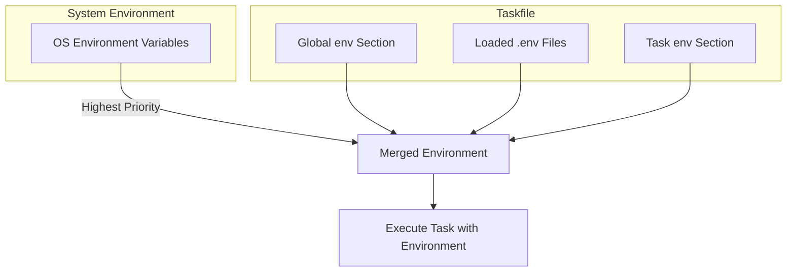

# Environment Management & .env Files

Task empowers you to manage your system and project-specific environments effectively, enabling consistent, reproducible automation workflows. This guide unpacks how Task integrates with environment variables, supports `.env` files, and orchestrates environment variable precedence to create portable and reliable build environments.

---

## Understanding Environment Management in Task

Environment variables serve as a cornerstone for controlling task behavior without hardcoding values. Task supports multiple layers of environment configuration that work together fluidly:

- **System Environment Variables:** Variables defined in your OS shell
- **Environment Section in Taskfile:** Static variables declared under `env` at the global or task level
- **`.env` Files:** Loading environment variables from key-value files
- **Command-Level Overrides:** Variables defined in task execution or included Taskfiles

When you run a task, Task merges these sources thoughtfully, favoring the closest or explicitly set values to ensure your automation runs with the correct context.

### Why Environment Management Matters

Consider a cross-platform build task that requires API keys, URLs, or feature toggles. You don’t want to embed secrets or environment details into the Taskfile directly. Instead, environment management lets you: 

- Keep sensitive data out of source control
- Switch between development, staging, and production settings effortlessly
- Ensure tasks behave as expected regardless of the host system

---

## Loading and Using `.env` Files

Task supports loading environment variables from `.env` files within both global and task contexts. This feature allows for standardized environment setups across projects.

### How `.env` Files Work

A `.env` file contains lines of key-value pairs, for example:

```env
API_KEY=1234567890abcdef
DEBUG=true
DATABASE_URL=postgres://localhost/db
```

In Taskfiles, you can specify one or more `.env` files to load using the `dotenv` field either globally or per task:

```yaml
version: '3'
dotenv:
  - '.env'

tasks:
  build:
    dotenv:
      - 'build.env'
    cmds:
      - echo "$API_KEY"
```

When executed, Task reads these files, merges their values, and injects them into the task environment.

### Variable Precedence within `.env` Files

Task only sets variables from `.env` files if they are not already present in the environment or overridden by explicit `env` or `vars` declarations. This means your shell environment variables will take precedence over `.env` entries unless experimental flags alter the behavior.

### Practical Tips for `.env` Usage

- Use `.env` files for sensitive and environment-specific variables to avoid hardcoding.
- You can declare multiple `.env` files in order; later files can override earlier ones.
- When running tasks locally, double-check that your shell environment does not unintentionally override `.env` variables.
- For dynamic `.env` file paths, you can use vars templating:

```yaml
vars:
  DOTENV_FILE: '.env.dev'

tasks:
  start:
    dotenv:
      - '{{.DOTENV_FILE}}'
    cmds:
      - echo "$DATABASE_URL"
```

---

## How Environment Variables Are Merged and Prioritized

Understanding how Task resolves and prioritizes environment variables helps avoid confusion and ensures predictable task execution.

### Environment Variable Sources and Their Priority

1. **Task Execution Call Environment:** Variables set externally in your terminal session or CI environment.
2. **Taskfile `env` Section:** Variables explicitly defined under `env` in your Taskfile (global or per task).
3. **`.env` File Variables:** Loaded from the `.env` files specified.
4. **Task `vars` and Command `vars`:** These are primarily used for interpolation but can influence environment variables indirectly.

In practice, Task preserves your shell environment variables first, then applies `env` variables, and finally falls back on `.env` file values if no conflicts occur.

### Environment Variable Example Behavior

Consider this Taskfile snippet:

```yaml
version: '3'
env:
  GREETING: "Hello from global env"
dotenv:
  - '.env'

tasks:
  greet:
    env:
      GREETING: "Hello from task env"
    dotenv:
      - 'special.env'
    cmds:
      - echo "$GREETING"
```

Assuming `.env` contains `GREETING=Hello from .env` and `special.env` contains `GREETING=Hello from special.env`, when you run `task greet`, the output would be:

```
Hello from task env
```

Because the task-level `env` overrides `.env` file values.

---

## Strategies for Portable and Reproducible Environments

Robust automation requires predictable, portable environments that behave consistently across machines and CI systems.

### Best Practices

- **Commit `.env.example` Files:** Provide scaffold `.env` files with placeholders highlighting expected variables without secrets.
- **Use `.env` Files for Sensitive and Environment-Specific Values:** Keep these out of Taskfiles to reduce leakage of secrets or system-specific info.
- **Explicitly Declare Required Environment Variables:** Use preconditions or validation to catch missing variables early (see [Conditional Execution & Preconditions](https://go-task.github.io/guides/advanced-features-best-practices/conditional-execution-preconditions/)).
- **Avoid Overriding System Environment Variables Unintentionally:** Let environment variables from the OS take precedence to adapt across environments unless an explicit override is necessary.
- **Leverage Namespaced Includes:** Pass variables to included Taskfiles to isolate environments cleanly (see [Including and Sharing Taskfiles](https://go-task.github.io/guides/advanced-features-best-practices/including-sharing-taskfiles/)).

### Example: Creating a Portable Build Environment Using `.env`

```yaml
version: '3'
dotenv:
  - '.env'

tasks:
  build:
    cmds:
      - echo "Building project with URL: $API_URL"
      - ./build.sh
```

Your `.env` file:

```env
API_URL=https://staging.example.com/api
```

This setup allows any user or CI runner to replicate the environment without changing the Taskfile.

---

## Environment Variable Injection Flow

Below is a conceptual flow illustrating how environment variables are collected and merged during task execution:



This flow ensures the most explicit and immediate environment settings dominate, while still leveraging `.env` files for fallback configuration.

---

## Common Pitfalls and Troubleshooting

<AccordionGroup title="Tips for Troubleshooting Environment Issues">
<Accordion title="Task Not Picking Up .env Variables">
- Ensure the `.env` file path is correct and accessible.
- Make sure the `dotenv` field is properly declared in your Taskfile or task.
- Verify that `.env` file syntax follows `KEY=VALUE` format without quotes or spaces.
- Run `task --debug` to see loaded environment variables.
</Accordion>
<Accordion title="Environment Variables Not Overridden as Expected">
- Remember your shell environment variables take precedence unless the experimental flag to invert precedence is enabled.
- Check for conflicting declarations in `env` sections or command-level overrides.
</Accordion>
<Accordion title="Variable Interpolation Confusion">
- Variables under `vars` are for interpolation in the Taskfile YAML, not for environment injection.
- Use the `env` section to explicitly set environment variables, or load them via `.env` files.
</Accordion>
</AccordionGroup>

---

## See Also

- [Variables and Templating](https://go-task.github.io/guides/advanced-features-best-practices/variables-and-templating) — Learn how variable interpolation integrates with environment variables.
- [Including and Sharing Taskfiles](https://go-task.github.io/guides/advanced-features-best-practices/including-sharing-taskfiles) — Best practices for managing envs across reusable Taskfile modules.
- [Conditional Execution & Preconditions](https://go-task.github.io/guides/advanced-features-best-practices/conditional-execution-preconditions) — Use preconditions to enforce required environment variables.
- [Environment Reference](https://go-task.github.io/website/src/docs/reference/environment.md) — Overview of Task-specific environment variables.

---

Mastering environment management and `.env` support in Task allows you to create automation workflows that are flexible, secure, and portable. Leveraging these capabilities prevents common issues with configuration drift and improves collaboration across your team and CI pipelines.

---