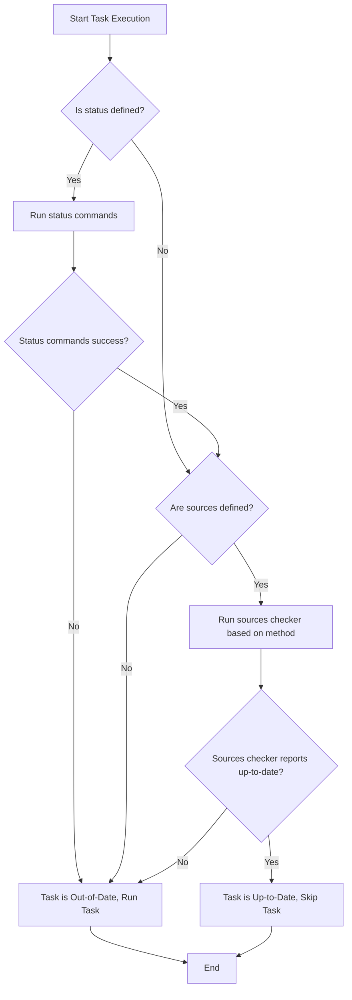

# Fingerprinting & Up-to-Date Checks

Task leverages fingerprinting techniques to determine whether a task needs to run or can be skipped, ensuring your automation is both efficient and incremental. This approach reduces unnecessary work by reliably detecting changes in relevant files or task status.

---

## Why Fingerprinting Matters

In automation workflows, repeatedly running every command regardless of changes wastes time and resources. Fingerprinting allows Task to avoid this by checking if the outputs or dependencies of a task have changed since the last run. If nothing relevant has changed, Task recognizes the task as "up-to-date" and skips execution.

This system enables:

- **Incremental builds:** Only updated inputs trigger task runs.
- **Faster automation:** Less redundant work.
- **Accurate checks:** Based on real file data or explicit commands.

## Core Concepts

### What Is Fingerprinting?

Fingerprinting is the process of generating a unique representation (or "fingerprint") of a task's state or sources. Task compares this fingerprint between runs to detect changes.


### Two Key Checks: Sources & Status

Task supports two complementary up-to-date checks for each task:

1. **Sources Check** – Detects if input files have changed using checksum or timestamps.
2. **Status Check** – Executes custom shell status commands defined in the task to determine its state.

Depending on your Taskfile, either or both checks can be configured. When both are specified, both must indicate the task as up-to-date for Task to skip the task.

---

## How Task Checks If a Task Is Up-to-Date

At a high level, Task uses the following decision process:

1. Check if the task defines a `status` command list.
2. Check if the task has `sources` defined.
3. Perform the configured checks accordingly:
   
   - **Status Check:** Runs each status command:
     - If any command exits with an error, the status is considered out-of-date.
     - Otherwise, the status is considered up-to-date.
   
   - **Sources Check:** Uses the defined fingerprinting method:
     - `timestamp` method compares modification times of source and generated files.
     - `checksum` method calculates a checksum hash over source files contents to detect changes.
     - `none` disables source checking and always detects changes.

4. Aggregate results:
   - If both checks are defined, both must be up-to-date to skip the task.
   - If only one is defined, its result determines the task's up-to-date status.
   - If none is defined, the task is never considered up-to-date and will always run.

---

## Fingerprinting Methods Explained

Task supports multiple methods to fingerprint your task sources. You control this by setting the task's `method` field (e.g., `timestamp` or `checksum`).

### 1. Timestamp Method

This method compares modification timestamps of your source files against output files (generates).

- **How it works:**
  - Task finds the newest modification time among all your generated outputs.
  - It then checks if any source file is newer than the newest output.
  - If any source is newer, the task is out-of-date.
  - It uses a special timestamp file in Task's internal temp directory to track execution time.

- **Best for:**
  - Projects where file modification times are reliable and sufficient.

- **Example:**
  ```yaml
  tasks:
    build-ts:
      method: timestamp
      sources:
        - ./source.txt
      status:
        - echo '{{.TIMESTAMP}}'
  ```

### 2. Checksum Method

This method calculates a hash based on the full contents and names of all source files.

- **How it works:**
  - Task calculates an xxh3 hash from filenames and file content.
  - It compares this checksum to the previously saved value.
  - Changes in content or file renames cause the checksum to differ.
  - Checksum is saved in Task’s internal temp directory.

- **Best for:**
  - Projects where file contents are the authoritative change indicator.
  - When timestamps can be unreliable (e.g., cross-platform syncing).

- **Example:**
  ```yaml
  tasks:
    build-checksum:
      method: checksum
      sources:
        - ./source.txt
      status:
        - echo '{{.CHECKSUM}}'
  ```

### 3. None Method

Disables source fingerprinting, always indicating sources are out-of-date.

- Useful if you want Task to ignore source checks and rely on status only or always run.

---

## Status Checks in Detail

Status checks run one or more shell commands that return zero (success) if the task is considered up-to-date.

- You define `status` as a list of shell commands in your Taskfile.
- Each command runs in the task’s working directory with the task’s environment.
- If any command fails, the status check fails, forcing the task to run.

This feature lets you define custom logic such as querying build tools, verifying outputs, or other domain-specific checks.

Example:

```yaml
tasks:
  build:
    sources:
      - main.go
    status:
      - go list -m
      - test -f build/output
```

---

## Practical User Flow

Imagine you want to build a project only when your `src/` files change:

1. Set `sources` to match your source files.
2. Choose `method: checksum` to track content changes reliably.
3. Optionally, add `status` commands to verify a successful build output exists.

When you run Task, it follows this flow:

- Checks if source files' checksum changed since last run.
- Runs status commands to verify build output state.
- If both pass, skips the build task, saving time.

If you modify any source file or remove the output, Task detects changes and rebuilds.

---

## Common Pitfalls & Tips

### Tips

- **Pick the right method for your project:** Use `timestamp` when file system metadata are reliable; use `checksum` for content-sensitive workflows.
- **Always specify `generates` files:** They inform Task which outputs to consider when comparing timestamps.
- **Use `status` commands for complex state checks:** If your build process involves non-file dependencies, the status check can capture that.
- **Leverage dry runs (`--dry`) carefully:** Fingerprinting respects dry mode to avoid polluting fingerprints prematurely.

### Pitfalls to Avoid

- Relying on timestamps in environments where time synchronization is inconsistent can cause false positives or missed rebuilds.
- Omitting `generates` can cause timestamp checks to always trigger.
- Defining `sources` without status or fingerprint method results in always running tasks.

---

## Troubleshooting Fingerprint Checks

If you notice tasks running unexpectedly or being skipped:

<AccordionGroup title="Troubleshooting Fingerprinting and Up-to-Date Checks">
<Accordion title="Task always runs even if sources haven't changed">

- Check if `method` is set correctly (`timestamp` or `checksum`).
- Ensure `generates` files exist and are correctly specified.
- Verify that the timestamp files or checksum files in the temp directory are accessible and writable.
- Confirm status commands (if any) exit zero reliably.

</Accordion>
<Accordion title="Task never runs, even when sources changed">

- Confirm the hashes or timestamps files are updating properly.
- Check for file system permission issues that prevent updating fingerprint files.
- Ensure your `status` commands reflect the actual build state.

</Accordion>
<Accordion title="Checksum method seems slow or expensive">

- Large file sets can impact checksum calculation speed.
- Use `timestamp` method if performance is critical and timestamps are trustworthy.
- Consider excluding unnecessary files from `sources` globs.

</Accordion>
<Accordion title="Status commands fail unexpectedly">

- Run the status commands manually to troubleshoot.
- Use verbose logging (`-v`) for Task to see status command output and errors.

</Accordion>
</AccordionGroup>

---

## How Fingerprinting Maps to Task’s Code Model

Under the hood, Task represents fingerprint checking using two primary interfaces:

- **StatusCheckable:** Checks the `status` commands.
- **SourcesCheckable:** Checks source files according to the selected method.

The main function `IsTaskUpToDate` calls these interfaces in sequence and aggregates results, respecting these rules:

- If no fingerprinting is configured, task is never up-to-date.
- If both status and sources are defined, both must confirm up-to-date.
- If one is defined, its result decides.

This modular design allows adding new fingerprinting strategies without impacting existing workflows.

---

## Example Taskfile Snippet Using Checksum Fingerprinting

```yaml
version: '3'
tasks:
  build:
    method: checksum
    sources:
      - src/**/*.go
    generates:
      - bin/output
    status:
      - test -f bin/output
    cmds:
      - go build -o bin/output ./src
```

In this example:
- Task skips the build if source files have not changed in content.
- Build output presence is verified with a status command.
- Both must pass to skip the task.

---

## Visual Overview of the Up-to-Date Check Flow



---

## Summary

Fingerprinting in Task combines source file checks (timestamps or checksums) with customizable status commands to determine if a task should run or be skipped. This system saves time by avoiding redundant work, supports flexible workflows, and is configurable to fit diverse project needs.

Start by defining your `sources`, choose your fingerprint method, and optionally add `status` commands — and Task handles the rest to keep your automation fast and reliable.

---

For more details, see the [Taskfile Schema & Data Model](./taskfile_schema_concept) and [Execution Flow & Dependency Resolution](./execution_flow) documentation for how fingerprinting integrates within the overall task lifecycle.