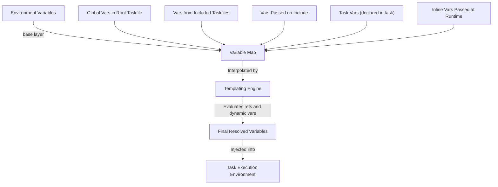

# Variables and Templating Engine

Understand how Task's variable system enables dynamic, DRY, and powerful build automation through variable interpolation, inheritance, scoping, and runtime evaluation with the internal templating engine.

---

## Introduction to Variables in Task

Variables in Task provide a flexible way to parameterize commands, conditionally modify behaviors, and reuse common values across Taskfiles. They help you avoid repetition and enable dynamic task execution tailored to your environment and inputs.

Variables can be defined globally, per included Taskfile, per task, or passed inline when calling tasks. The variable system supports static values, dynamic evaluation based on shell commands, and references that preserve type fidelity.

## How Variables Work

When Task runs a task, it collects variables from multiple sources, layering them to determine the final values used during templating:

- Environment variables from the OS
- Global variables defined in the root Taskfile
- Variables from included Taskfiles
- Variables declared in the task definition
- Variables passed inline on task calls or dependencies

This layered model enables variable inheritance and overrides, ensuring the most specific values apply.

### Scoping and Resolution Order

Variables are resolved in this order, with later sources overriding earlier ones:

1. Task-specific variables declared with `vars:` inside a task
2. Variables passed inline during task calls (e.g., via `vars` in `task:` cmds or `deps`)
3. Variables from the included Taskfile (if the task comes from an included file)
4. Variables from the include directive of the Taskfile (vars passed when including)
5. Global variables declared at the root level
6. Environment variables from the operating system

Variables at each level can themselves reference other variables using Go templating syntax, allowing interpolation and dynamic composition.

## Variable Types

Task supports several variable types:

- **Static values**: string, boolean, int, float, arrays, and maps
- **Dynamic variables**: shell commands that output a value at runtime (declared with `sh:`)
- **References**: variables that inherit or point to other variables by reference, preserving data type and allowing nested structures

### Static Variables

Static variables are defined directly with values or YAML structures. For example:

```yaml
vars:
  MESSAGE: "Hello, World!"
  FLAG: true
  COUNT: 42
  FLOAT_VALUE: 3.14
  LIST: [foo, bar, baz]
  MAP:
    map:
      key1: value1
      key2: value2
```

Static variables are fully resolved before task execution and usable for direct interpolation.

### Dynamic Variables

Dynamic variables contain a shell command whose output is captured and used as their value. Trailing newlines are stripped.

Example:

```yaml
tasks:
  build:
    vars:
      GIT_COMMIT:
        sh: git log -n 1 --format=%h
    cmds:
      - echo "Commit SHA: {{.GIT_COMMIT}}"
```

Dynamic variables are evaluated at runtime and cached during task execution for efficiency.

### References

Variables can refer to other variables by reference using the `ref:` key to preserve type (e.g., arrays, maps), enabling structured data passing:

```yaml
vars:
  BASE_LIST: [a, b, c]
  REF_LIST:
    ref: .BASE_LIST

tasks:
  use-ref:
    cmds:
      - echo {{index .REF_LIST 0}} # outputs 'a'
```

References support full Go templating expressions allowing accessing subkeys, indexing, and applying functions.

## Variable Interpolation and Templating

Task uses a powerful internal templating engine based on Go's [text/template](https://pkg.go.dev/text/template) package. This allows variables to be referenced and transformed inside double curly braces `{{ }}`.

Example of simple interpolation:

```yaml
tasks:
  greet:
    vars:
      NAME: Alice
    cmds:
      - echo "Hello, {{.NAME}}!"
```

Output:
```
Hello, Alice!
```

### Advanced Templating Features

The templating engine supports:

- Conditional expressions (`if`, `else`)
- Loops (`range`)
- Functions and pipes
- Variable scoping

Example conditional logic:

```yaml
vars:
  DEBUG: true

cmds:
  - echo "{{if .DEBUG}}Debug mode enabled{{else}}Production mode{{end}}"
```

### Available Functions

Task extends the Go template functions with numerous helpful utilities including:

- String manipulation (`trim`, `upper`, `lower`, `replace`)
- List operations (`splitList`, `join`, `uniq`)
- Mathematical computations (`add`, `mul`, `mod`)
- Date/time formatting
- JSON/YAML parsing and serialization
- Encoding/decoding (e.g., base64)

Refer to the [Templating Reference](./reference/templating) for a full function list and usage examples.

## Special Variables

Task automatically provides special variables that give context and runtime information:

| Variable Name    | Type     | Description                                         |
|------------------|----------|-----------------------------------------------------|
| `TASK`           | string   | Current executed task's name                         |
| `ALIAS`          | string   | Alias used to invoke the task (if any)               |
| `TASK_EXE`       | string   | Path or name of the task executable                  |
| `ROOT_TASKFILE`  | string   | Absolute path to the root Taskfile                    |
| `ROOT_DIR`       | string   | Directory of the root Taskfile                        |
| `TASKFILE`       | string   | Absolute path of the current Taskfile (included)     |
| `TASKFILE_DIR`   | string   | Directory of the current Taskfile                     |
| `TASK_DIR`       | string   | Directory where the task commands run                 |
| `USER_WORKING_DIR` | string | Directory where `task` was invoked                      |
| `CLI_ARGS`       | string   | Command line arguments passed after `--`             |
| `CLI_ARGS_LIST`  | []string | Same as above parsed as a list of strings             |
| `CLI_FORCE`      | bool     | Whether `--force` flag was set                        |
| `CLI_SILENT`     | bool     | Whether `--silent` flag was set                       |
| `CLI_VERBOSE`    | bool     | Whether `--verbose` flag was set                      |
| `CLI_OFFLINE`    | bool     | Whether `--offline` flag was set                      |
| `CHECKSUM`       | string   | Checksum of source files (for fingerprinting)        |
| `TIMESTAMP`      | time.Time| Last modified timestamp of source files               |
| `ITEM`           | any      | Current item when looping over a collection           |
| `EXIT_CODE`      | int      | Exit code of deferred command if non-zero             |

These variables are injected at runtime and cannot be overridden.

### Using Special Variables

```yaml
tasks:
  build:
    cmds:
      - echo "Running task {{.TASK}} located at {{.TASK_DIR}}"
      - echo "CLI arguments passed: {{.CLI_ARGS}}"
```

## Dynamic Evaluation and Caching

Dynamic variables (`sh:`) are executed at runtime to collect their values. To optimize performance:

- Dynamic variable outputs are cached during a single task run.
- Repeated dynamic variable calls reuse cached results.
- Any dynamic variable command failure aborts execution with error details.

### Example of Dynamic Variable Evaluation

```yaml
vars:
  DATE:
    sh: date +%Y-%m-%d

tasks:
  show-date:
    cmds:
      - echo "Today is {{.DATE}}"
```

## Variable Passing and Inheritance in Tasks

Variables can be passed inline when calling subtasks or dependencies, allowing fine-grained customization:

```yaml
tasks:
  notify:
    vars:
      USER: Alice
    cmds:
      - echo "Notify {{.USER}}"

  default:
    cmds:
      - task: notify
        vars:
          USER: Bob
```

In this example, the variable `USER` is overridden to `Bob` while calling `notify`.

Included Taskfiles also bring their own variables into the scope, merged with caller's variables, with included vars taking precedence.

## Practical Tips and Best Practices

- **Use variables to avoid duplication**. Define common paths, names, or flags globally and override only when necessary.
- **Leverage dynamic variables for values that change or need runtime computation** like Git commits, timestamps, or outputs.
- **Use references to preserve complex variable types** (arrays, maps) across task boundaries.
- **Validate required variables explicitly** using the `requires` attribute to catch missing variables early.
- **Be mindful of variable evaluation order** when referencing variables that depend on others.
- **Cache expensive dynamic variable commands** when possible by avoiding redefining the same shell commands repeatedly.
- **Escape special characters** in templated variables to avoid errors.

## Common Pitfalls and Troubleshooting

<AccordionGroup title="Troubleshooting Variable Problems">
<Accordion title="Why does a variable output <no value>?">
This often happens if a variable references another in a way that fails to resolve. Check for typos or circular references.
</Accordion>
<Accordion title="Dynamic variable commands failing">
Ensure the shell command is valid in the execution context and prints to STDOUT. Errors will cause task failure.
</Accordion>
<Accordion title="Type mismatch when using references">
Remember that interpolated variables rendered as strings lose their original types. Use `ref:` to keep types intact.
</Accordion>
<Accordion title="Variables not overridden as expected">
Verify the order of variable layers and that your overrides apply at the correct level (task inline vars > task vars > included > global).
</Accordion>
</AccordionGroup>

## Summary

The variable system with the internal templating engine in Task is the core mechanism that empowers dynamic, reusable, efficient automation. By understanding variable scopes, types, dynamic evaluation, and templating capabilities, users can craft flexible and maintainable Taskfiles that simplify complex builds with minimal repetition.

---

## Mermaid Diagram: Variable Resolution Flow



---

## See Also

- [Templating Reference](./reference/templating) — Comprehensive guide to functions and syntax
- [Using Variables & Templating (Guide)](/guides/advanced-features-best-practices/variables-and-templating) — Practical usage and examples
- [Including and Sharing Taskfiles](/guides/advanced-features-best-practices/including-sharing-taskfiles) — How variables interact with includes
- [Taskfile Schema & Data Model](/taskfile_concepts/core_architecture/taskfile_schema_concept) — Understanding variable data structures
- [Environment Management & .env Files](/taskfile_concepts/advanced_features/environment_and_dotenv) — Integrating shell environment variables

---

## References

- Go text/template documentation: https://pkg.go.dev/text/template
- Go task source (compiler.go, templater.go, var.go, vars.go) for variable internals

---
