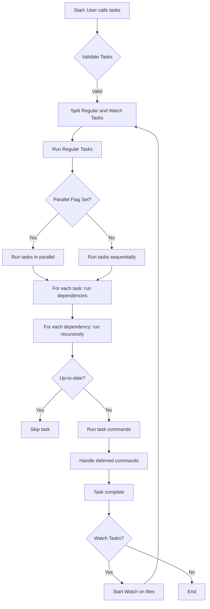

# Execution Flow & Dependency Resolution

Understand how tasks are scheduled, dependencies are resolved, and concurrency is handled. Explore how Task determines what to run, when, and in what order, supporting reproducible and parallelizable builds.

---

## Introduction

Task streamlines automation by controlling the execution order of tasks according to their dependencies, platform constraints, and user preferences. This flow guarantees that your builds, tests, and deployments follow the correct sequences, avoid redundant work, and leverage parallel execution safely.

In this guide, you'll unravel how Task:

- Validates requested tasks
- Resolves dependencies recursively
- Enforces maximum call limits to prevent infinite loops
- Runs tasks respecting platform constraints
- Handles up-to-date checks with fingerprinting
- Executes tasks in parallel or sequentially
- Manages watch mode for automatic reruns on changes

Whether you want to simply run a single task or orchestrate complex build pipelines, understand these internals to master Task's powerful yet user-friendly model.

---

## 1. Task Scheduling and Validation

### Task Lookup and Validation

Before execution, Task matches each requested task name to its corresponding definition in the Taskfile. This matching supports:

- Exact names
- Wildcard patterns for flexible matches
- Aliases for alternate task names

If a requested task is not found, Task provides helpful suggestions or errors. Internal tasks, marked as not runnable by users, are also detected and prevented from running directly but can be invoked as dependencies.

### Example

```yaml
# Requested tasks: 'build', 'test'

# Taskfile contains:
# build - compiles source
# test - runs tests
# clean - internal cleanup
```

If the user requests `build` and `test`, both are valid and runnable. Requesting `clean` would result in an error as it's internal.

---

## 2. Dependency Resolution

Dependencies (`deps`) express tasks that need to run before a dependent task. Task resolves dependencies recursively, running each dependent task's dependencies first.

### Dependency Execution Flow

1. **Collect all dependencies** for the target task(s).
2. **Recursively run dependencies** in order respecting their own dependencies.
3. Ensure **each dependency runs only once** per build session, even if multiple tasks depend on it.

### Parallel Dependency Execution

Dependencies run in parallel by default when the parent task is executed unless `--parallel` flag is disabled.

### Handling Cyclic Dependencies

To prevent infinite loops due to cyclic dependencies, Task imposes a maximum call count (`MaximumTaskCall` = 1000) per task per execution. Exceeding this triggers an error.

### Example

```yaml
tasks:
  build:
    deps: [prepare, compile]
  prepare:
    cmds: [echo "preparing"]
  compile:
    cmds: [echo "compiling"]
```

Running `build` will first run `prepare` and `compile`, possibly in parallel.

---

## 3. Platform Constraints

Both tasks and commands can specify `platforms:` to restrict execution to certain OS and architectures.

- Task or command with no platforms set runs on all.
- When platform constraints exist, Task compares them against the current system.
- Tasks/commands not matching the current platform are skipped gracefully.

### Example

```yaml
build-windows:
  platforms:
    - os: windows
  cmds:
    - echo "Build for Windows"
```

On Linux, `build-windows` is skipped.

---

## 4. Up-to-Date Checks & Fingerprinting

Task supports up-to-date checks to avoid running unnecessary work, leveraging fingerprinting methods.

- **Fingerprinting Methods:** checksum (default) or timestamp
- Task determines if sources or generated files changed or if task preconditions require execution
- Using flags like `--force` or `--force-all` overrides up-to-date checks

If a task is up-to-date, it is skipped with a message.

---

## 5. Execution Modes

### Regular Execution

- Tasks run sequentially or in parallel based on CLI flags
- Dependencies must complete successfully before dependent tasks run
- Commands within a task run sequentially
- Supports deferred commands (`defer`) that run after all other commands

### Watch Mode

- When `--watch` flag or `watch: true` task property is set, Task watches relevant files
- Changes trigger re-execution of the watched tasks
- Uses efficient OS-level notifications via `fsnotify`
- Ignores common unwanted paths (e.g., `.git`, `node_modules`)
- Automatically re-registers new directories at intervals

### Dry Run and Summary

- `--dry` compiles and prints task commands without executing
- `--summary` outputs an overview of tasks without running

---

## 6. Concurrency and Limits

### Concurrency Limits

- Controlled with `--concurrency` or `-C` flag
- Limits number of concurrent tasks to avoid resource saturation

### Task Call Count

- Protects against runaway recursion with a maximum allowed task calls per execution

### Output Management

- Supports different output modes (`interleaved`, `group`, `prefixed`)
- Provides informative logs with colors and verbosity toggles

---

## 7. User Flow Example: Running Tasks with Dependencies and Watch Mode

Imagine you have a Taskfile defining tasks and dependencies:

```yaml
tasks:
  build:
    cmds:
      - echo "Building..."
    deps: [lint, test]
  lint:
    cmds:
      - echo "Linting code"
  test:
    cmds:
      - echo "Running tests"
    watch: true
```

You run:

```bash
task build --watch
```

- Task begins by validating the `build` task.
- It processes dependencies `lint` and `test` recursively.
- `lint` runs first, then `test`.
- Since `test` has `watch: true`, Task watches files related to `test`.
- Upon relevant file changes, `test` re-runs automatically.
- Once dependencies finish, `build` runs.

This flow ensures proper order, parallelism where appropriate, and responsiveness via watching.

---

## Mermaid Diagram: Simplified Execution Flow



---

## Troubleshooting

- **Task Not Found:** Double-check spelling, use `--list` or `--list-all` flags.
- **Cyclic Dependencies:** Review task dependencies for cycles; reduce recursion.
- **Skipped Due to Platform:** Confirm your OS/architecture and platform constraints.
- **Tasks Not Running (Up-to-Date):** Use `--force` to override or update sources.
- **Watch Mode Not Triggering:** Verify watched paths and ignore patterns.

---

## Best Practices

- Define clear dependencies to ensure correct build order.
- Use platform constraints to avoid unnecessary runs.
- Keep task names unique; prefer aliases only when useful.
- Regularly review and prune dependencies to reduce complexity.
- Use concurrency limits thoughtfully to balance resource usage.
- Leverage `watch` mode for active development to speed feedback.

---

## Additional Resources

- [Taskfile Schema & Data Model](taskfile_schema_concept) - Learn the structuring of tasks and dependencies.
- [Fingerprinting & Up-to-Date Checks](fingerprinting_up_to_date) - Understand how Task decides to skip tasks.
- [Command Line Interface Reference](../reference/cli) - Details on CLI flags affecting execution.
- [Common Automation Workflows](../guides/getting-started-workflows/common-workflows) - Examples of typical use cases.

---

Mastering the execution flow and dependency resolution empowers you to write efficient, reliable automation workflows that maximize productivity and reduce errors. Use this guide as a foundational step to deepen your understanding and optimize your Task usage.
