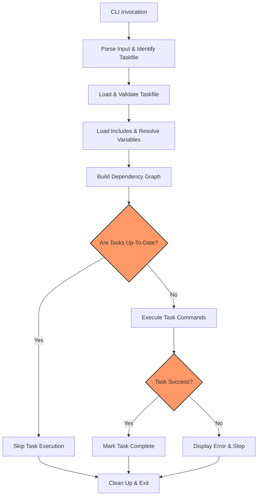

# How Task Runs: The Big Picture

Discover how Task orchestrates your automation workflows from start to finish. This guide walks you through the entire lifecycle of a task execution—from parsing inputs and resolving the correct Taskfile to managing environments, resolving dependencies, and executing commands reliably and efficiently. Understanding this journey empowers you to optimize your Taskfiles and troubleshoot with confidence.

---

## 1. The Journey Begins: Parsing Input and Identifying Your Taskfile

Every Task run starts when you invoke the Task CLI with a command. Task first parses this input to determine:

- Which Taskfile to load (defaults to `Taskfile.yml`, but this can be customized).
- What task(s) to execute.
- Any command-line variables or flags to apply.

This initial step sets the stage for all subsequent operations.

**Tip:** Always ensure your Taskfile exists in the expected location unless explicitly overridden, or Task won’t be able to proceed.

## 2. Loading and Resolving the Correct Taskfile

Task loads the Taskfile YAML into memory, validating its schema and preparing its internal representation.

This process includes:

- Parsing task definitions, dependencies, commands, variables, and environment settings.
- Processing included Taskfiles (if any) for modular or shared automation.
- Resolving variable references and environment inheritance.

**Best Practice:** Keep your Taskfiles well-structured and modular by leveraging includes to avoid duplication and simplify maintenance.

## 3. Managing Environments and Variables

Before execution, Task merges multiple layers of environment variables:

- System environment variables.
- Variables defined within variables and environment sections of your Taskfile.
- `.env` files loaded automatically if configured.

This layered approach ensures commands run with the correct context, providing reliable and repeatable task executions.

**Pro Tip:** Use environment variables and `.env` files to keep sensitive values or configuration details out of your Taskfile for security and flexibility.

## 4. Dependency Resolution: Building the Execution Graph

Task analyzes task dependencies recursively:

- It traverses the dependency tree to understand task order.
- Detects cycles to prevent infinite loops.
- Applies conditional execution and preconditions.

This graph-based approach guarantees tasks execute in the correct sequence respecting dependencies.

**Note:** Define dependencies precisely to avoid unnecessary task runs and make the best use of Task’s fingerprinting system.

## 5. Fingerprinting and Up-to-Date Checks

To optimize efficiency, Task can skip tasks that are "up-to-date" by leveraging its fingerprinting system. This system evaluates:

- **Status Checks:** By running custom status commands defined per task.
- **Sources Checks:** Using file checksums or timestamps to detect changes in source files.

### How Fingerprinting Works

1. **Status Checker:** Executes specified status commands. If any command exits with a non-zero status, the task is considered out-of-date.
2. **Sources Checker:** Calculates checksums or inspects file timestamps of source files and compares them against stored data. If sources changed or generated outputs are missing, the task runs.

If both checks pass, Task intelligently skips the task to save time.

<AccordionGroup title="Fingerprinting Strategies and Behaviors">
<Accordion title="Status Checker">
The Status Checker runs your custom status commands sequentially. Each command runs in the task's working directory using the defined environment. If any command returns a failure, this marks the task as needing execution.

This allows you to integrate complex custom logic to determine task freshness.

Example:
```yaml
tasks:
  build:
    status:
      - test -f build/output.bin
``` 
</Accordion>
<Accordion title="Sources Checker">
The Sources Checker uses either timestamps or checksums to monitor your source files:

- **Timestamps:** Compares modification times between sources and generated outputs.
- **Checksums:** Generates hash values based on file content.

It also verifies that all expected generated files exist before marking the task as up-to-date.

Example:
```yaml
tasks:
  build:
    sources:
      - src/**/*.go
    generates:
      - build/output.bin
``` 
</Accordion>
</AccordionGroup>

## 6. Executing Commands Predictably and Efficiently

Once dependencies are resolved and tasks are determined to run, Task executes commands:

- Executes each task's commands sequentially.
- Honors working directories, environment variables, and platform-specific constraints.
- Supports running multiple tasks in parallel where safe and appropriate.

During this phase, you receive live, clear output from commands, with Task handling error propagation and cleanup as defined.

**Checklist for Successful Runs:**

- Commands must return expected exit codes.
- Necessary files and environment must be available.
- Dependencies must be satisfied.

## 7. Handling Errors and Recovery

If a task fails mid-execution:

- Task stops further execution unless configured to continue.
- It provides detailed error messages, including which task and command failed.
- Fingerprinting handles recovery by resetting state as needed to avoid false positives on subsequent runs.

Utilize the `--verbose` flag to gain insights during failure and debugging.

---

## Visualizing the Task Run Lifecycle



---

## Practical Tips for Users

- **Understand your Taskfile structure:** Know where tasks, dependencies, variables, and environment configurations reside to predict execution flow.
- **Leverage fingerprinting:** Define `status`, `sources`, and `generates` fields to avoid redundant executions, boosting CI/CD pipeline speed.
- **Use includes for modularity:** This enables scalable automation across complex projects.
- **Manage environment carefully:** Variables cascade from `.env` files, system, and Taskfile declarations—plan accordingly.
- **Debug with verbosity:** Use verbosity flags and inspect task logs when executions deviate from expectations.

---

## Troubleshooting Common Issues

### Taskfile Not Found
- Verify the Taskfile is named correctly and located in the working directory.
- Check `--taskfile` override flags if using custom paths.

### Task Skips Unexpectedly
- Confirm if fingerprinting `status` or `sources` are defined and working as intended.
- Temporarily disable fingerprinting or adjust status commands to test behavior.

### Dependency Cycles
- Review dependent tasks to ensure no circular references.
- Refactor tasks to break cycles.

### Environment Missing Variables
- Validate `.env` files and system environment variables.
- Use `task --list-vars` (if available) to inspect final variable values.

---

## Final Thoughts
Grasping how Task runs from start to finish arms you with the knowledge to craft performant, maintainable automation. This big-picture view reveals the thoughtful design enabling Task’s predictability and power. Leverage this understanding to build Taskfiles that scale with your project and integrate smoothly into your workflows.


---

For deeper understanding, explore the following related concepts:
- [Taskfile Schema & Data Model](../taskfile_concepts/core_architecture/taskfile_schema_concept)
- [Execution Flow & Dependency Resolution](../taskfile_concepts/core_architecture/execution_flow)
- [Variables and Templating Engine](../taskfile_concepts/advanced_features/variable_system)
- [Environment Management & .env Files](../taskfile_concepts/advanced_features/environment_and_dotenv)
- [Fingerprinting & Up-to-Date Checks](../taskfile_concepts/advanced_features/fingerprinting_up_to_date)

---

_To contribute or view implementation details, visit the [GitHub repository](https://github.com/go-task/task)._