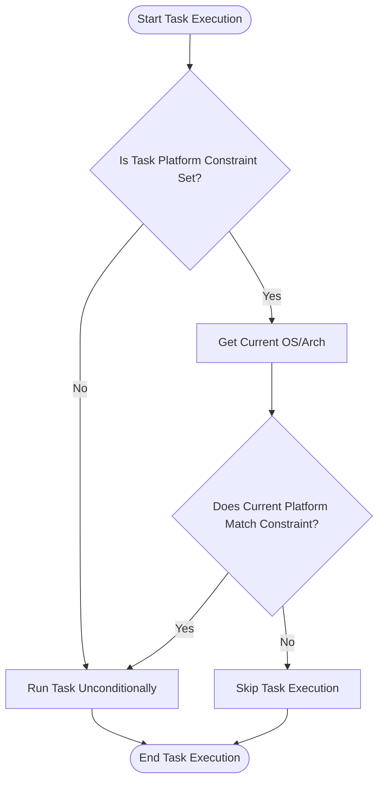

# Platform Constraints and Multi-Platform Builds

Task empowers you to create flexible, cross-platform automation workflows by enabling platform-specific builds and conditional execution of tasks. This means you can target different operating systems (OS) and architectures (Arch) from a single Taskfile or across multiple Taskfiles, streamlining your build pipelines and development workflows without duplicating configuration.

---

## Understanding Platform Constraints in Task

Platform constraints let you specify **where** particular tasks or commands should run, based on the underlying OS and hardware architecture. The platform information corresponds directly to Golang’s known OS (`GOOS`) and architecture (`GOARCH`) values, ensuring compatibility with typical development and deployment environments.

### How Platforms Are Defined

- **OS (Operating System):** Such as `windows`, `linux`, `darwin` (macOS), `freebsd`, etc.
- **Arch (Architecture):** Such as `amd64`, `386`, `arm`, `arm64`, `riscv64`, and more.

Task allows specifying only an OS, only an architecture, or a combination in formats like:

- `linux`
- `amd64`
- `windows/386`

This granularity provides precise control over when tasks or commands should execute.

### Use Cases for Platform Constraints

- Run a build task only on Windows machines.
- Execute deployment commands on Linux arm64 servers.
- Disable certain tasks on unsupported architectures.

By embedding these constraints, you ensure your automation workflow adapts dynamically to the execution environment.

<Info>
Platform values correspond to Go’s verified lists of supported OS and architecture identifiers, guaranteeing alignment with standard builds and tooling.
</Info>

---

## Specifying Platform Constraints in Taskfiles

Within a Taskfile, **platform constraints** can be applied at multiple levels:

- On individual tasks
- On commands within tasks

This enables you to finely tune which portions of automation run under which conditions.

### Example: Task-Level Platform Constraints

```yaml
version: '3'
tasks:
  build-linux:
    cmds:
      - echo "Building for Linux amd64"
    platform:
      os: linux
      arch: amd64

  build-windows:
    cmds:
      - echo "Building for Windows 386"
    platform: windows/386
```

In this example, `build-linux` only runs on Linux/amd64 systems, and `build-windows` only on Windows/386.

### Example: Command-Level Platform Constraints

```yaml
version: '3'
tasks:
  build:
    cmds:
      - cmd: echo "Building for Linux"
        platform: linux
      - cmd: echo "Building for Windows"
        platform: windows
```

Each command runs conditionally, depending on the OS that Task is executing on.

---

## Multi-Platform Builds with Taskfiles

Task’s platform constraints form the backbone for managing **multi-platform builds**, widely used in cross-compilation and multi-target CI/CD setups.

### Single Taskfile Handling Multiple Platforms

Instead of maintaining separate Taskfiles per platform, you can cater to multiple OS/Arch targets within one Taskfile using conditional platform directives. This reduces overhead and sync errors.

```yaml
version: '3'
tasks:
  build:
    cmds:
      - cmd: go build -o bin/app-linux-amd64
        platform: linux/amd64
      - cmd: go build -o bin/app-windows-386.exe
        platform: windows/386
      - cmd: go build -o bin/app-darwin-arm64
        platform: darwin/arm64
```

### Or Use Multiple Taskfiles for Platform-Specific Specialization

In complex projects, you might have multiple Taskfiles, each targeting a platform or set of platforms explicitly. Task’s **includes** feature enables referencing and composing Taskfiles, letting each specialize for their respective platforms while maintaining a clean structure.

For example:
- `Taskfile.linux.yml` with Linux-specific tasks
- `Taskfile.windows.yml` for Windows builds
- A main `Taskfile.yml` including them selectively


---

## Platform Environment Variables and Precedence

Task synchronizes platform constraints with environment variables, mirroring Go's standard variables:

- `GOOS` represents the platform OS
- `GOARCH` represents the architecture
- `CGO_ENABLED` can be set when cross-compiling

These environment variables are available inside tasks and commands, enabling dynamic references and scripts to adapt accordingly.

<Tip>
Platform constraints in Taskfiles influence, but do not override, explicitly set `GOOS` or `GOARCH` environment variables during task execution unless those variables are also configured accordingly.
</Tip>

### Environment Variable Overrides Example

```sh
GOOS=windows GOARCH=amd64 task build
```

You can manually override the platform the Taskfile targets via environment variables when running tasks. However, using platform constraints within the Taskfile enforces consistent conditional execution.

---

## Integration with GoReleaser and Build Pipelines

Task’s approach to platform constraints aligns well with tools like [GoReleaser](https://goreleaser.com), which supports complex multi-platform builds and packaging.

- Define matching platform targets in both Taskfiles and GoReleaser configuration.
- Use Task to run platform-specific build and artifact preparation commands before GoReleaser packages your binaries.

This synergy simplifies build orchestration in CI/CD environments targeting multiple OS/Arch combinations.

---

## Best Practices for Using Platform Constraints

### 1. Clearly Define Supported Platforms Early

Use platform constraints at a high level to document which platforms you support within your build tasks, making your automation explicit and maintainable.

### 2. Leverage Platform Constraints to Skip Incompatible Tasks

Prevent task execution failure on unsupported platforms by restricting tasks or commands with platform constraints rather than conditionally scripting inside commands.

### 3. Combine with Conditional Execution for Fine Control

Use platform constraints alongside conditional execution features (like `if` statements on variables) for complex scenarios where multiple parameters drive task runs.

### 4. Test Platform-Specific Tasks in Corresponding Environments

Validate platform-constrained tasks on their intended OS/Arch to catch environment-specific issues early.

### 5. Consider Modularizing Large Multi-Platform Workflows

Split your Taskfiles modularly per platform and include them via namespaces for clearer separation and easier management.

---

## Troubleshooting Common Issues

<AccordionGroup title="Common Challenges with Platform Constraints">
<Accordion title="A Task Doesn't Run on My OS/Arch">
Verify the platform constraint values in the Taskfile match your OS and architecture exactly.
Run `task --debug` to see platform evaluation.
Check via `go env GOOS GOARCH` what your system reports.
</Accordion>
<Accordion title="Platform Constraint Syntax Errors">
Ensure platform strings are in one of these forms only: `os`, `arch`, or `os/arch`.
Unknown or misspelled values will cause parsing errors.
Refer to Task’s known platform lists derived from Go’s syslist.
</Accordion>
<Accordion title="Environment Variables Not Set as Expected">
Remember Task merges environment variables with platform constraints but does not automatically set `GOOS` or `GOARCH` unless explicitly defined.
Set these variables in your Taskfile or execution environment if needed.
</Accordion>
<Accordion title="Cross-Compilation with CGO Issues">
Set `CGO_ENABLED=0` when cross-compiling for platforms where CGO is not supported.
This is commonly needed for Windows targets from Linux builds.
</Accordion>
</AccordionGroup>

---

## Platform Constraint Parsing and Validation

Task parses platform strings internally according to strict rules:

- Accepts either an OS, Arch, or combination OS/Arch
- Rejects invalid or empty values
- Maps to known OS and Arch from Go’s official lists

This validation ensures you only work with supported platform identifiers.

### Internal Platform Parsing Example (Conceptual)

```go
// Accepted formats
"linux"
"amd64"
"windows/386"

// Invalid (will error)
"invalid"
"linux/invalid"
"windows/"
""
```

Always use recognized platform identifiers as listed in Go's official documentation or Task's validated lists.

---

## Visualizing Platform-Based Execution Flow



This flow demonstrates the decision-making process Task uses to execute or skip tasks based on platform constraints.

---

## Summary

Platform constraints and multi-platform builds enable you to manage cross-platform automation elegantly within a single Taskfile or distributed across multiple Taskfiles. By using this feature, you can confidently develop build, test, and deployment automation that adapts to your environment, avoids errors caused by incompatible platforms, and optimizes your workflows across diverse operating systems and architectures.

Use platform constraints to write maintainable and robust automation that respects the native environment, integrates smoothly with multi-platform tools like GoReleaser, and supports scalable, maintainable CI/CD pipelines.

---

## Additional Resources

- [Core Concepts and Terminology](https://taskfile.dev/overview/introduction-concepts/core-concepts) — Understand foundational Task concepts.
- [Conditional Execution & Preconditions](https://taskfile.dev/guides/advanced-features-best-practices/conditional-execution-preconditions) — Combine platform constraints with intelligent conditional logic.
- [Including and Sharing Taskfiles](https://taskfile.dev/guides/advanced-features-best-practices/including-sharing-taskfiles) — Modularize multi-platform Taskfiles.
- [Taskfile Schema & Data Model](https://taskfile.dev/taskfile_concepts/core_architecture/taskfile_schema_concept) — Deeper understanding of Taskfile internals.
- [GoReleaser’s Multi-Platform Build Guide](https://goreleaser.com) — Best practices for multi-target releases.

---

## Summary of Key Commands and Snippets

```yaml
# Taskfile snippet for platform constraints
tasks:
  build-linux-amd64:
    cmds:
      - echo "Building for Linux amd64"
    platform: linux/amd64

  build-windows-386:
    cmds:
      - echo "Building for Windows 386"
    platform: windows/386

# Command-level platform constraint
  build:
    cmds:
      - cmd: echo "Build Linux"
        platform: linux
      - cmd: echo "Build Windows"
        platform: windows
```

```sh
# Running a task forcing environment variables (manual override)
GOOS=windows GOARCH=amd64 task build
```
